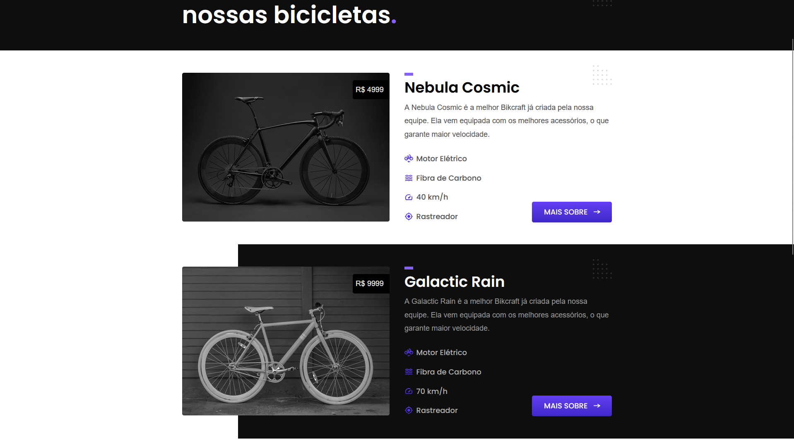

<h1 align="center"> Bikcraft   </h1>

  

  <a href="#-tecnologias" style="color: #517ac8;">Tecnologias 🚀</a>&nbsp;&nbsp;&nbsp;|&nbsp;&nbsp;&nbsp;
  <a href="#-projeto" style="color: #517ac8;">Projeto 💻</a>&nbsp;&nbsp;&nbsp;|&nbsp;&nbsp;&nbsp;
  <a href="#-layout" style="color: #517ac8;">Layout 🔖</a>&nbsp;&nbsp;&nbsp;|&nbsp;&nbsp;&nbsp;
  <a href="#-licença" style="color: #517ac8;">Licença 📕</a>

 

  

## 🚀 Tecnologias

Esse projeto foi desenvolvido com as seguintes tecnologias:

- HTML, CSS & JS
- Git, Github
- Figma

## 💻 Projeto

Projeto realizado com a finalidade de aperfeiçoar habilidades com UI Design, Figma, HTML & CSS

- <a href="https://raphetes.github.io/bikcraft/" style="color: #517ac8" target="_blank">Acesse o projeto</a>

## 🔖 Layout

Você pode visualizar o layout do projeto através <a href="https://www.figma.com/design/CrCv9vetJeMKiRBJnbPTqr/bikcraft?node-id=0-1&p=f&t=dJfu1vZmgebiCWJe-0" style="color: #517ac8;" target="_blank">desse link</a>.

---
## 📕 Licença

Feito com carinho por Raphael Melo.
